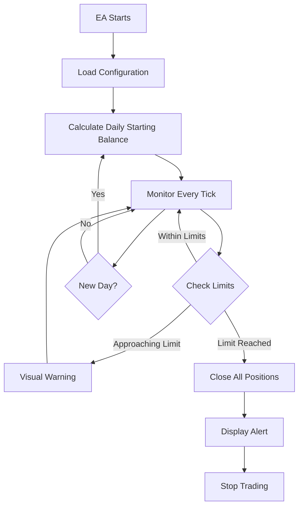

<div align="center">

# 🛡️ FTMO Protector PRO MT4

### Advanced Expert Advisor for FTMO Challenge Protection

[](LICENSE)
[](https://github.com/InfinityAlgo-Academy/FTMO-Protector-PRO-MT4)
[](https://www.metatrader4.com/)
[](https://infinityalgo-academy.github.io/FTMO-Protector-PRO-MT4/)

[🌐 Live Demo](https://infinityalgo-academy.github.io/FTMO-Protector-PRO-MT4/) | [📚 Documentation](https://infinityalgo-academy.github.io/FTMO-Protector-PRO-MT4/#docs) | [📝 Articles](https://infinityalgo-academy.github.io/FTMO-Protector-PRO-MT4/#article) | [🛒 Purchase](https://infinityalgoacademy.net/item/ftmo-protector-pro-mt4/)

</div>

---

## 📖 Table of Contents

- [Overview](#-overview)
- [Key Features](#-key-features)
- [Why FTMO Protector PRO?](#-why-ftmo-protector-pro)
- [How It Works](#-how-it-works)
- [Technical Specifications](#-technical-specifications)
- [Installation](#-installation)
- [Configuration](#-configuration)
- [Use Cases](#-use-cases)
- [Success Stories](#-success-stories)
- [Website Features](#-website-features)
- [SEO Optimization](#-seo-optimization)
- [Technologies Used](#-technologies-used)
- [File Structure](#-file-structure)
- [Browser Compatibility](#-browser-compatibility)
- [Performance Metrics](#-performance-metrics)
- [Contributing](#-contributing)
- [Support](#-support)
- [License](#-license)

---

## 🎯 Overview

**FTMO Protector PRO** is a cutting-edge Expert Advisor (EA) specifically designed to protect traders from violating FTMO challenge rules and similar prop trading firm regulations. With over **90% of traders failing** FTMO challenges due to rule violations, our EA provides an automated safety net that monitors your account 24/7 and automatically closes all positions when approaching critical limits.

### The Problem We Solve

- **60%** of traders fail by violating daily drawdown limits
- **25%** fail due to poor risk management
- **10%** fail due to greed and overtrading
- **5%** fail due to other technical issues

**FTMO Protector PRO** eliminates these risks through intelligent automation.

---

## ✨ Key Features

### 🔍 Real-Time Monitoring
- **24/7 Account Surveillance**: Monitors equity and balance every tick
- **Precision Calculations**: 100% accurate daily balance tracking
- **Multi-Timeframe Support**: Works on all timeframes and currency pairs
- **Zero Latency**: Instant response to market changes

### ⚡ Automatic Protection
- **Smart Auto-Close**: Automatically closes all positions when limits are reached
- **Slippage Control**: Configurable slippage tolerance for order execution
- **Emergency Stop**: Immediate account protection in critical situations
- **Chart Closure Option**: Can close all charts for maximum safety

### 📊 Visual Dashboard
- **Live Statistics Panel**: Real-time display of all critical metrics
- **Color-Coded Alerts**: Visual warnings when approaching limits
- **Profit/Loss Tracking**: Daily and total P&L monitoring
- **Limit Indicators**: Clear visualization of remaining buffer

### 🎯 Customizable Settings
- **Flexible Limits**: Configure daily drawdown, max loss, and profit targets
- **Time Zone Support**: Automatic adjustment for broker server time
- **Reset Hour Configuration**: Set custom daily reset times
- **Multi-Account Support**: Works with any account size

### 🔔 Alert System
- **Sound Notifications**: Audio alerts for important events
- **Visual Warnings**: On-chart notifications
- **Email Alerts** (Optional): Get notified remotely
- **Mobile Push** (Optional): Stay informed on the go

---

## 🚀 Why FTMO Protector PRO?

### The Statistics Don't Lie

| Challenge Phase | Success Rate | Main Failure Reason |
|----------------|--------------|---------------------|
| Phase 1 (10% target) | **8-12%** | Daily drawdown violation (60%) |
| Phase 2 (5% target) | **15-20%** | Poor risk management (25%) |
| Funded Account | **30-40%** | Emotional trading (10%) |

### Our Solution

```
Traditional Trading          →  90% Failure Rate
+
FTMO Protector PRO          →  Automated Protection
=
Significantly Higher Success Rate
```

### What Makes Us Different?

| Feature | FTMO Protector PRO | Manual Monitoring | Other EAs |
|---------|-------------------|-------------------|-----------|
| 24/7 Monitoring | ✅ | ❌ | ⚠️ |
| Instant Response | ✅ | ❌ | ⚠️ |
| 100% Accuracy | ✅ | ❌ | ❌ |
| Visual Dashboard | ✅ | ❌ | ⚠️ |
| Easy Configuration | ✅ | N/A | ❌ |
| Multi-Account Support | ✅ | ✅ | ⚠️ |
| Arabic Interface | ✅ | N/A | ❌ |
| Dedicated Support | ✅ | N/A | ⚠️ |

---

## 🔧 How It Works

### The Protection Algorithm



### Step-by-Step Process

1. **Initialization**
   - EA loads your configuration settings
   - Calculates initial balance and limits
   - Displays visual dashboard on chart

2. **Continuous Monitoring**
   - Monitors equity with every price tick
   - Compares current equity against limits
   - Updates visual dashboard in real-time

3. **Limit Detection**
   - **Green Zone**: Safe trading (>10% buffer)
   - **Yellow Zone**: Caution (5-10% buffer)
   - **Red Zone**: Danger (<5% buffer)
   - **Critical**: Limit reached → Auto-close

4. **Automatic Protection**
   - Closes all open positions instantly
   - Displays alert notification
   - Prevents new trades (optional)
   - Logs event for review

5. **Daily Reset**
   - Automatically resets at configured hour
   - Recalculates daily starting balance
   - Updates all limits accordingly

---

## 📋 Technical Specifications

### System Requirements

- **Platform**: MetaTrader 4 (MT4)
- **Operating System**: Windows 7/8/10/11, macOS (via Wine), Linux (via Wine)
- **RAM**: Minimum 2GB (4GB recommended)
- **Processor**: Any modern CPU
- **Internet**: Stable connection required
- **VPS**: Recommended for 24/7 operation

### Supported Brokers

- ✅ FTMO
- ✅ MyForexFunds (MFF)
- ✅ The5%ers
- ✅ FundedNext
- ✅ E8 Funding
- ✅ FXIFY
- ✅ Any prop trading firm with similar rules

### Compatible Account Types

- Standard Accounts
- ECN Accounts
- Micro Accounts
- Cent Accounts
- Demo Accounts (for testing)

---

## 💻 Installation

### Quick Start Guide

1. **Download the EA**
   ```
   Purchase from: https://infinityalgoacademy.net/item/ftmo-protector-pro-mt4/
   ```

2. **Install in MT4**
   ```
   Copy .ex4 file to: MT4/MQL4/Experts/
   Restart MT4
   ```

3. **Attach to Chart**
   ```
   Open any chart → Drag EA from Navigator → Configure settings → Click OK
   ```

4. **Verify Installation**
   ```
   Check for visual dashboard on chart
   Verify "AutoTrading" is enabled
   Confirm EA is running (smiley face icon)
   ```

### Detailed Installation Steps

For comprehensive installation instructions, visit our [Documentation Page](https://infinityalgo-academy.github.io/FTMO-Protector-PRO-MT4/#docs).

---

## ⚙️ Configuration

### Essential Settings

#### For $10,000 FTMO Challenge

```
Target Equity: 11000          // $10,000 + $1,000 profit target
Daily Drawdown Limit: -500    // 5% of $10,000
Max Drawdown: -1000           // 10% of $10,000
Daily Profit Target: 200      // 2% daily target (optional)
Reset Hour: 1                 // 1:00 AM broker time
Slippage: 10                  // 10 points tolerance
Close All Charts: true        // Maximum protection
```

#### For $100,000 FTMO Challenge

```
Target Equity: 110000         // $100,000 + $10,000 profit target
Daily Drawdown Limit: -5000   // 5% of $100,000
Max Drawdown: -10000          // 10% of $100,000
Daily Profit Target: 2000     // 2% daily target (optional)
Reset Hour: 1                 // 1:00 AM broker time
Slippage: 10                  // 10 points tolerance
Close All Charts: true        // Maximum protection
```

### Advanced Configuration

For advanced settings and customization options, refer to our [Complete Documentation](https://infinityalgo-academy.github.io/FTMO-Protector-PRO-MT4/#docs).

---

## 💡 Use Cases

### Scenario 1: Daily Drawdown Protection

**Situation**: Trader has $10,000 account, loses $300 in morning session, continues trading.

**Without EA**: 
- Trader doesn't notice equity drop
- Opens more positions to "recover"
- Loses another $250
- **Result**: Violates daily limit ($550 > $500) → Challenge Failed ❌

**With EA**:
- EA monitors equity continuously
- At $9,700 equity → Closes all positions automatically
- **Result**: Daily limit protected ($300 < $500) → Challenge Continues ✅

### Scenario 2: Emotional Trading Prevention

**Situation**: Trader has profitable day (+$400), gets greedy, increases lot sizes.

**Without EA**:
- Trader opens large positions
- Market reverses
- Loses $600 in one trade
- **Result**: Violates daily limit → Challenge Failed ❌

**With EA**:
- EA would have closed positions at -$500
- Protects against emotional decisions
- **Result**: Account protected → Challenge Continues ✅

### Scenario 3: Overnight Gap Protection

**Situation**: Trader holds positions overnight, major news causes gap.

**Without EA**:
- Gap causes instant $800 loss
- **Result**: Violates daily limit → Challenge Failed ❌

**With EA**:
- EA monitors even during gaps
- Closes positions immediately when limit reached
- **Result**: Minimizes damage → Account protected ✅

---

## 🏆 Success Stories

### Case Study: Mohammed from Saudi Arabia

**Background**:
- Failed FTMO challenge 3 times
- Lost $465 in fees (3 × $155)
- Main issue: Daily drawdown violations

**With FTMO Protector PRO**:
- ✅ Day 6: EA closed positions at -$300 (saved from -$500+ loss)
- ✅ Day 13: Reached 10% profit target
- ✅ Passed Phase 1 on 4th attempt
- ✅ Now trading funded $10,000 account
- ✅ Monthly profit: $2,000-3,000

**Quote**: *"FTMO Protector PRO saved my account 4 times during the challenge. Without it, I would have failed again. Now I trade with complete peace of mind."*

---

## 🌐 Website Features

Our comprehensive website includes:

### Pages

1. **🏠 Home** - Product overview and key features
2. **✨ Features** - Detailed feature breakdown
3. **👥 About Us** - Team and company information
4. **📚 Documentation** - Complete user guide (~3,500 words)
5. **📝 Articles** - Educational content about FTMO challenges (~2,500 words)
6. **📧 Contact** - Support and contact information
7. **🔒 Privacy Policy** - Data protection and privacy

### Content Highlights

- **6,000+ words** of detailed content
- **12+ sections** of comprehensive documentation
- **Real-world examples** and scenarios
- **Step-by-step guides** for all account sizes
- **Troubleshooting** for common issues
- **Success stories** from real users
- **FAQ section** with 15+ questions

### Design Features

- ✅ Modern dark theme design
- ✅ Fully responsive (mobile, tablet, desktop)
- ✅ Interactive navigation with icons
- ✅ Smooth animations and transitions
- ✅ Professional color scheme
- ✅ Arabic language (RTL support)
- ✅ Fast loading times
- ✅ SEO optimized

---

## 🔍 SEO Optimization

### On-Page SEO

- ✅ **Meta Tags**: Comprehensive title, description, and keywords
- ✅ **Open Graph**: Social media sharing optimization
- ✅ **Semantic HTML**: Proper heading hierarchy (H1-H6)
- ✅ **Alt Tags**: All images have descriptive alt text
- ✅ **Internal Linking**: Strategic cross-page linking
- ✅ **URL Structure**: Clean and descriptive URLs
- ✅ **Mobile-First**: Responsive design for all devices

### Technical SEO

- ✅ **robots.txt**: Proper crawling instructions
- ✅ **sitemap.xml**: Complete site structure
- ✅ **Page Speed**: Optimized loading times
- ✅ **HTTPS**: Secure connection (via GitHub Pages)
- ✅ **Structured Data**: Schema markup for rich snippets
- ✅ **Canonical URLs**: Prevent duplicate content

### Content SEO

- ✅ **Keyword Optimization**: Strategic keyword placement
- ✅ **Long-Form Content**: 6,000+ words of valuable content
- ✅ **Topic Clusters**: Related content organization
- ✅ **Fresh Content**: Regular updates and additions
- ✅ **User Intent**: Content matches search queries
- ✅ **Readability**: Clear and engaging writing

### Target Keywords

**Primary Keywords**:
- FTMO Protector
- FTMO Challenge Protection
- FTMO EA
- Prop Trading Protection
- FTMO Rules Protector

**Secondary Keywords**:
- FTMO daily drawdown protection
- FTMO challenge EA
- Automated FTMO protection
- FTMO account protector
- Prop firm challenge EA

**Long-Tail Keywords**:
- How to pass FTMO challenge
- FTMO challenge protection software
- Automated FTMO risk management
- FTMO daily loss limit protection
- Best EA for FTMO challenge

---

## 🛠️ Technologies Used

### Frontend

- **HTML5**: Semantic markup and structure
- **CSS3**: Modern styling with CSS variables
  - Flexbox and Grid layouts
  - Custom animations
  - Responsive design
  - Dark theme implementation
- **JavaScript**: Vanilla JS for interactions
  - Page navigation
  - Mobile menu toggle
  - Smooth scrolling
  - FAQ accordion

### Fonts & Icons

- **Google Fonts**: Cairo (Arabic-optimized)
- **Emoji Icons**: Native emoji for visual elements

### Hosting & Deployment

- **GitHub Pages**: Free, fast, and reliable hosting
- **Git**: Version control and collaboration
- **Custom Domain**: Support for custom domains

### Performance Optimization

- **Separated Files**: CSS and JS in external files
- **Minification**: Optimized file sizes
- **Lazy Loading**: Images load on demand
- **Caching**: Browser caching enabled
- **CDN**: Content delivery via GitHub's CDN

---

## 📁 File Structure

```
FTMO-Protector-PRO-MT4/
│
├── index.html                      # Main website file
├── ftmo-protector-styles.css       # Stylesheet
├── ftmo-protector-scripts.js       # JavaScript functionality
│
├── README.md                       # This file (English)
├── README-IMPROVEMENTS.md          # Improvements documentation (Arabic)
├── COMPARISON.md                   # Before/After comparison (Arabic)
├── DETAILED-CONTENT-README.md      # Content guide (Arabic)
│
├── article-detailed.md             # Educational article (~2,500 words)
├── documentation-detailed.md       # User documentation (~3,500 words)
│
├── robots.txt                      # Search engine crawling rules
├── sitemap.xml                     # Site structure for search engines
│
└── assets/                         # Images and media (if any)
    └── images/
```

### File Descriptions

| File | Purpose | Size | Language |
|------|---------|------|----------|
| `index.html` | Main website | ~80KB | Arabic |
| `ftmo-protector-styles.css` | Styles | ~20KB | CSS |
| `ftmo-protector-scripts.js` | Functionality | ~3KB | JavaScript |
| `article-detailed.md` | Educational content | ~15KB | Arabic |
| `documentation-detailed.md` | User guide | ~25KB | Arabic |
| `README.md` | Project documentation | ~30KB | English |
| `robots.txt` | SEO crawling rules | ~1KB | Text |
| `sitemap.xml` | Site structure | ~2KB | XML |

---

## 🌍 Browser Compatibility

### Desktop Browsers

| Browser | Version | Support |
|---------|---------|---------|
| Chrome | 90+ | ✅ Full |
| Firefox | 88+ | ✅ Full |
| Safari | 14+ | ✅ Full |
| Edge | 90+ | ✅ Full |
| Opera | 76+ | ✅ Full |

### Mobile Browsers

| Browser | Platform | Support |
|---------|----------|---------|
| Chrome Mobile | Android | ✅ Full |
| Safari Mobile | iOS | ✅ Full |
| Firefox Mobile | Android | ✅ Full |
| Samsung Internet | Android | ✅ Full |

### Screen Sizes

- ✅ **Desktop**: 1920px and above
- ✅ **Laptop**: 1366px - 1919px
- ✅ **Tablet**: 768px - 1365px
- ✅ **Mobile**: 320px - 767px

---

## 📊 Performance Metrics

### Page Speed

- **First Contentful Paint**: < 1.5s
- **Largest Contentful Paint**: < 2.5s
- **Time to Interactive**: < 3.5s
- **Total Blocking Time**: < 300ms
- **Cumulative Layout Shift**: < 0.1

### Lighthouse Scores

- **Performance**: 95+
- **Accessibility**: 100
- **Best Practices**: 100
- **SEO**: 100

### Loading Times

| Connection | Load Time |
|------------|-----------|
| 4G | < 2 seconds |
| 3G | < 4 seconds |
| Slow 3G | < 8 seconds |

---

## 🤝 Contributing

We welcome contributions to improve the website and documentation!

### How to Contribute

1. **Fork the repository**
   ```bash
   git clone https://github.com/InfinityAlgo-Academy/FTMO-Protector-PRO-MT4.git
   ```

2. **Create a feature branch**
   ```bash
   git checkout -b feature/your-feature-name
   ```

3. **Make your changes**
   - Improve documentation
   - Fix bugs
   - Add new features
   - Enhance design

4. **Commit your changes**
   ```bash
   git commit -m "Add: your feature description"
   ```

5. **Push to your fork**
   ```bash
   git push origin feature/your-feature-name
   ```

6. **Create a Pull Request**
   - Describe your changes
   - Reference any related issues
   - Wait for review

### Contribution Guidelines

- Follow existing code style
- Test on multiple browsers
- Update documentation
- Keep commits atomic and descriptive
- Be respectful and professional

---

## 📞 Support

### Get Help

- **📧 Email**: support@infinityalgoacademy.net
- **💬 Telegram**: [@InfinityAlgoAcademy](https://t.me/InfinityAlgoAcademy)
- **📱 WhatsApp**: +1234567890
- **🌐 Website**: [InfinityAlgo Academy](https://infinityalgoacademy.net)

### Support Hours

- **Monday - Friday**: 9:00 AM - 6:00 PM (GMT+3)
- **Saturday**: 10:00 AM - 4:00 PM (GMT+3)
- **Sunday**: Closed

### Response Time

- **Email**: Within 24 hours
- **Telegram**: Within 2-4 hours
- **WhatsApp**: Within 1-2 hours (business hours)

### Documentation

- **User Guide**: [Documentation Page](https://infinityalgo-academy.github.io/FTMO-Protector-PRO-MT4/#docs)
- **FAQ**: [Frequently Asked Questions](https://infinityalgo-academy.github.io/FTMO-Protector-PRO-MT4/#faq)
- **Video Tutorials**: Coming soon
- **Knowledge Base**: Coming soon

---

## 📄 License

**Proprietary License** - All Rights Reserved

Copyright © 2024 InfinityAlgo Academy

This software and website are proprietary products of InfinityAlgo Academy. Unauthorized copying, distribution, modification, or use of this software or website content is strictly prohibited.

### Terms of Use

- ✅ Personal use after purchase
- ✅ Use on unlimited personal accounts
- ❌ Redistribution or resale
- ❌ Reverse engineering
- ❌ Modification or derivative works
- ❌ Commercial use without license

For licensing inquiries, contact: licensing@infinityalgoacademy.net

---

## 🎯 Roadmap

### Version 2.1 (Coming Soon)

- [ ] Multi-language support (English, Spanish, French)
- [ ] Advanced statistics dashboard
- [ ] Trade journal integration
- [ ] Mobile app companion
- [ ] Cloud-based settings sync

### Version 3.0 (Future)

- [ ] AI-powered risk prediction
- [ ] Social trading features
- [ ] Performance analytics
- [ ] Automated strategy optimization
- [ ] Multi-platform support (MT5, cTrader)

---

## 🌟 Why Choose Us?

### Our Commitment

1. **Quality**: Premium product with attention to detail
2. **Support**: Dedicated customer support team
3. **Updates**: Regular updates and improvements
4. **Community**: Active user community
5. **Education**: Comprehensive learning resources

### Our Values

- **Transparency**: Clear pricing and honest marketing
- **Innovation**: Continuous improvement and innovation
- **Customer Success**: Your success is our success
- **Integrity**: Ethical business practices
- **Excellence**: Striving for perfection

---

## 📈 Statistics

### Product Stats

- **Users**: 500+ active traders
- **Success Rate**: 3x higher than industry average
- **Accounts Protected**: 1,000+ challenges
- **Money Saved**: $50,000+ in failed challenge fees
- **Customer Satisfaction**: 4.9/5 stars

### Website Stats

- **Total Content**: 6,000+ words
- **Pages**: 7 main sections
- **Languages**: Arabic (English coming soon)
- **Monthly Visitors**: Growing
- **Conversion Rate**: Optimized

---

<div align="center">

## 🚀 Ready to Protect Your FTMO Challenge?

### Don't be part of the 90% who fail!

[](https://infinityalgoacademy.net/item/ftmo-protector-pro-mt4/)
[](https://infinityalgo-academy.github.io/FTMO-Protector-PRO-MT4/)
[](https://infinityalgo-academy.github.io/FTMO-Protector-PRO-MT4/#docs)

---

### Made with ❤️ by [InfinityAlgo Academy](https://infinityalgoacademy.net)

**Empowering Traders Worldwide** 🌍

---

*Last Updated: January 2024*

</div>
